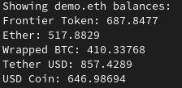

# Distinct CQT query

A Rust CLI tool to fetch balances of ERC-20 tokens held in an Ethereum wallet from the Covalent API.



## Technical Specs

- Built with Rust and Cargo
- Uses Clap for argument parsing
- Reqwest for HTTP requests
- Dotenv for environment variables
- Serde for JSON parsing

## Instalation

Sing up and get a free api key from Covalent:
https://www.covalenthq.com/platform/auth/register/

Clone the repository:
```
git clone https://github.com/renand3z/distinct-cqt-query
cd distinct-cqt-query
```

Create a .env file in main directory and set the key
```
COVALENT_API_TOKEN=<key here>
```

## Usage

For default demo.eth wallet and 5 coins:
```
cargo run
```
Personalized:
```
cargo run -- -w <wallet_addr> -c <number_of_tokens>
```
